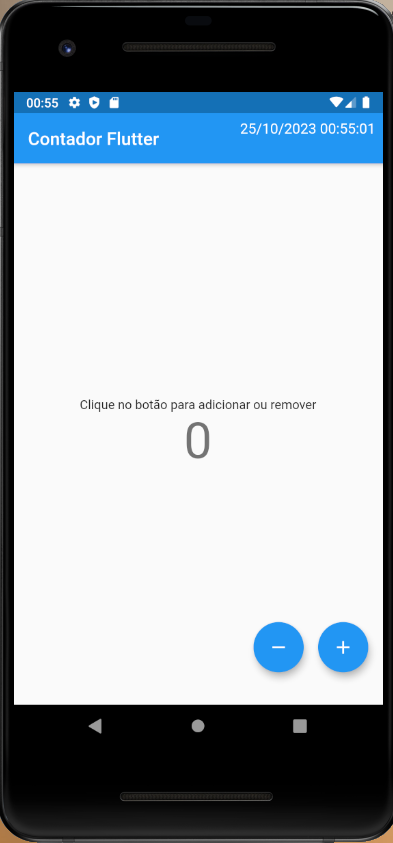
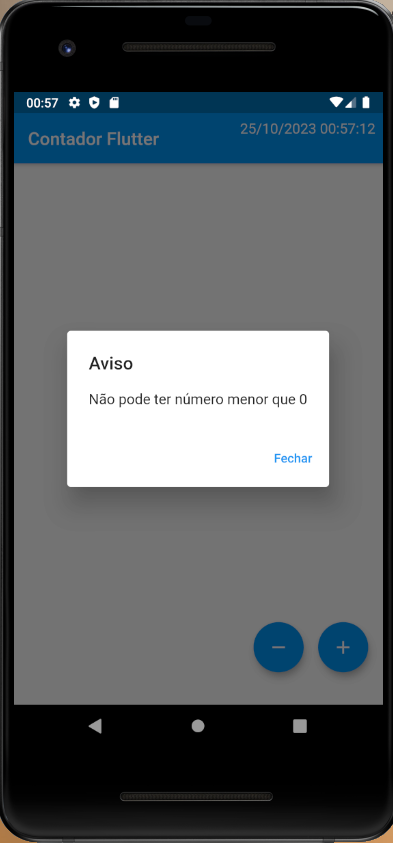
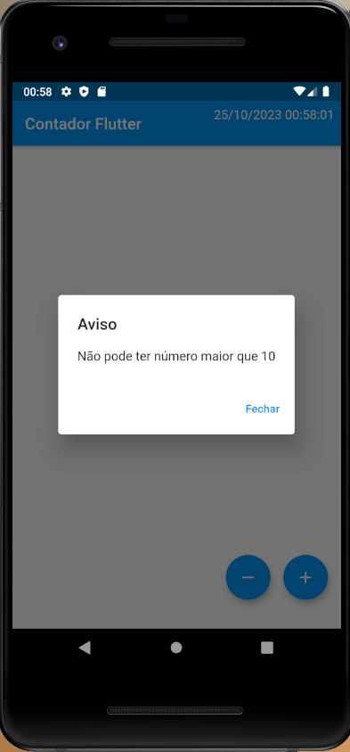

# Contador com Flutter

Projeto de estudos com Flutter. Neste projeto peguei o start que o Flutter dá e fiz algumas adições como:

 - Validação para o valor não ser menor que **zero**
 - Validação para o valor não ser maior que **dez**
 - Adição do botão de decremento do valor
 - Uso de outros Widgets para ajustar o botão
  - Positioned, Container, Row, etc.

## Imagens do Projeto

## Getting Started

Caso queira fazer mais algumas adições a este projeto fique a vontade.
O mesmo foi desenvolvido com foco no estudos no Flutter.

- [Lab: Write your first Flutter app](https://flutter.dev/docs/get-started/codelab)
- [Cookbook: Useful Flutter samples](https://flutter.dev/docs/cookbook)

For help getting started with Flutter, view our
[online documentation](https://flutter.dev/docs), which offers tutorials,
samples, guidance on mobile development, and a full API reference.
